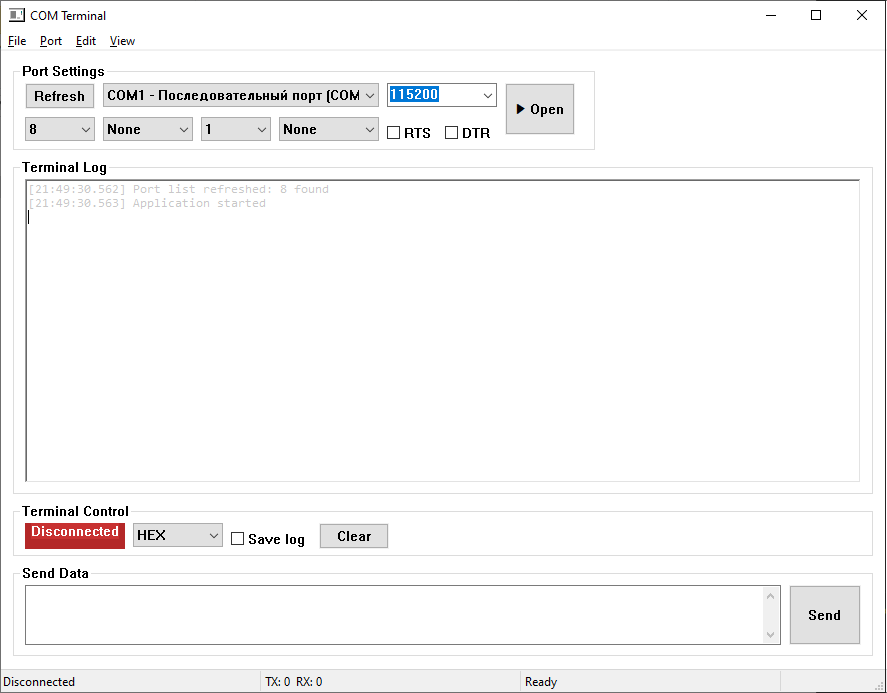

# COM Terminal



## Описание проекта

`COM Terminal` – это простое графическое приложение для Windows, написанное на C++ и использующее Win32 API. Приложение позволяет подключаться к последовательным (COM) портам, управлять их настройками и обмениваться данными в режиме реального времени.

## Реализовано

- **Выбор порта** – отображается список доступных COM‑портов со строкой `port - friendlyName`.
- **Настройка параметров передачи**
  - Скорость (baud rate)
  - Количество данных битов (5‑8)
- **Отправка данных** – текстовое поле и кнопка `Send`. Текст конвертируется в UTF‑8 перед отправкой.
- **Приём данных** – данные отображаются либо как строка (UTF‑8/ACP), либо в HEX, в зависимости от выбранного режима.

## Структура проекта

```text
COMTerminal/
├─ build.bat          # Сценарий сборки (CMake + MSBuild)
├─ src/
│  ├─ main.cpp        # Точка входа, создание окна
│  │  ├─ LogVirtualizer.cpp
│  │  └─ ...
│  └─ ui/
│     └─ MainWindow.cpp   # UI и обработчики сообщений
├─ resources/        # Иконки, ресурсы приложения
└─ logs/             # Сохраняемые логи (генерируется во время работы)
```

## Как собрать

1. Установите **CMake** и **MSBuild**.
2. Перейдите в корень проекта.
3. Запустите `build.bat` – он создаст каталог `build`, сгенерирует проект для Visual Studio, соберёт его и разместит исполняемый файл в `build/Debug/COMTerminal.exe` (или `Release`).

```bat
@echo off
mkdir build
pushd build
cmake .. -G "NMake Makefiles"
cmake --build . --config Debug
popd
```

## Как запустить

После сборки в папке `build/Debug` (или `Release`) найдите файл `COMTerminal.exe`. Запустите его двойным кликом. Откроется главное окно, где можно выбрать порт и настроить параметры.

## Как пользоваться программой

### 1. Подключение к порту

1. Откройте программу `COMTerminal.exe` (папка `build/Debug`).
2. На главном окне выберите нужный порт из выпадающего списка **Port**.
3. Установите желаемые параметры: скорость, количество битов данных, паритет и т.д. (эти настройки совпадают с настройками в терминале).
4. Нажмите кнопку **Open**. Если соединение установлено – индикатор станет зелёным.

### 2. Отправка текста

1. В поле `Send Text` напишите строку, которую хотите отправить.
2. Нажмите кнопку **Send** (или клавишу `Ctrl+S`).
3. На терминале вы увидите сообщение «TX» и переданные байты.

### 3. Бинарный режим

1. Для ввода данных в шестнадцатеричном формате откройте выпадающий список **Receive Mode** и выберите **HEX**.
2. В поле `Send Text` теперь можно вводить последовательность байтов в виде `0A 1F FF …`. Программа автоматически преобразует их в текст, если это возможно, но для чистого бинарного потока лучше использовать HEX‑режим.
3. Нажмите **Send** – данные будут отправлены как набор байт.

## Бинарный режим (HEX)

Для отправки и приёма **не‑текстовых** байтов используется режим «HEX»:

1. В выпадающем списке **Receive Mode** выберите пункт **HEX** – это заставит приложение интерпретировать каждую введённую строку как набор шестнадцатеричных байтов.
2. При отправке в поле *Send Text* укажите последовательность байт, например `0A 1F FF` (разделитель может быть пробелом или запятой).
3. Нажмите **Send** – приложение преобразует строку в массив байтов и передаст их по открытому порту.

При приёме данные будут отображаться как шестнадцатеричное представление, а не читаемый текст. Для просмотра в привычном виде можно переключиться обратно на «Text».

## Вклад

Если хотите улучшить проект – создайте issue или pull request.

## От автора

Не стесняйтесь сообщать о любых проблемах или предлагать улучшения!

- Связаться со мной вы можете в [телеграмм](https://t.me/AsuRaHan)

- Собираю донаты [тут](https://boosty.to/asurahan/single-payment/donation/677381/target?share=target_link)